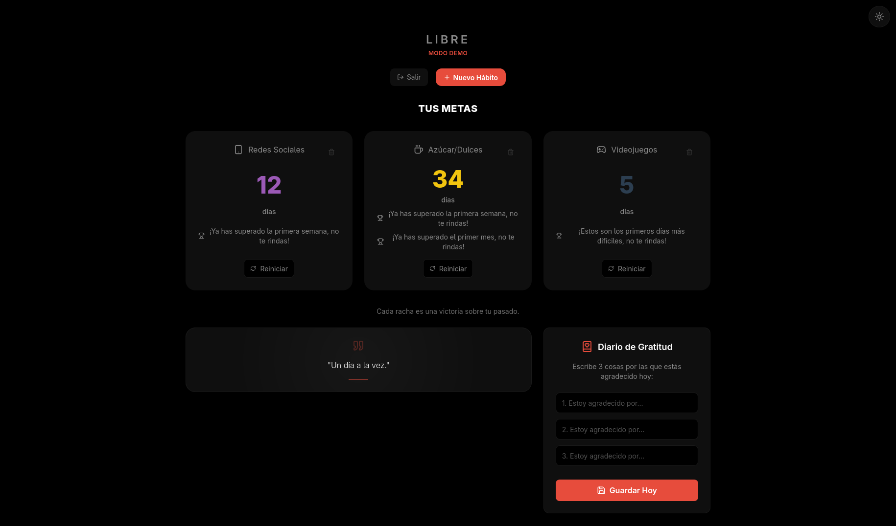

# Libre - Un dia a la vez

> **Idioma / Language:** [Español](./README.md) | [English](./README.en.md)

Aplicacion web progresiva (PWA) para acompañar procesos de recuperacion de habitos con seguimiento diario, apoyo emocional y herramientas de emergencia.



## Caracteristicas principales

- **Autenticacion** con Firebase Auth (registro, login y recuperacion de contraseña).
- **Modo demo** para probar la app sin crear una cuenta.
- **Onboarding** inicial para seleccionar habitos personalizados.
- **Contadores** por habito con progreso por horas y dias.
- **Diario de gratitud** para registrar reflexiones diarias.
- **Notificaciones** configurables por habito.
- **Progreso y logros** con hitos visuales.
- **Boton SOS** con consejos y acciones inmediatas de apoyo.

## Stack tecnico

- React 19 + Vite 7
- Firebase (Auth + Firestore)
- Tailwind CSS
- ESLint + Prettier + markdownlint
- React Doctor

## Scripts utiles

```bash
npm install
npm run dev
npm run lint
npm run build
npm run doctor
npm run lint:md
npm run format
```

## CI/CD

Workflows de GitHub Actions incluidos:

- `CI`: ejecuta lint + build en `push` y `pull_request`.
- `Deploy`: publica a GitHub Pages en `main`.

## Informacion

| | |
| --- | --- |
| **Repositorio** | [github.com/Rsengar1412/app_abitos](https://github.com/Rsengar1412/app_abitos) |
| **Licencia** | [MIT](./LICENSE) |

## 👑 Contributors

<a href="https://github.com/Rsengar1412/app_abitos/graphs/contributors">
  
</a>

---

_Cada momento cuenta. Mantente fuerte._
